<h1 align="center">
  <picture>
    <source media="(prefers-color-scheme: dark)" srcset="docs/images/readme-banner-dark.png">
    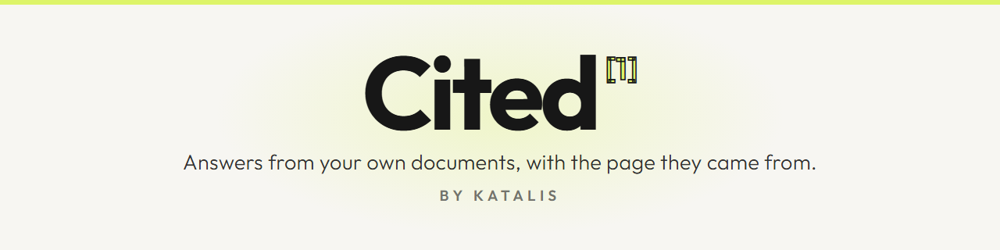
  </picture>
</h1>

<p align="center">Pregúntale a tus propios documentos. Recibe el pasaje y de dónde salió.</p>

[](LICENSE)
[](package.json)
[](package.json)
[](https://www.typescriptlang.org/)
[](https://github.com/tursodatabase/libsql)

[](https://github.com/RonnieGex/cited/actions/workflows/ci.yml)

[English](README.md) · [Español](README.es.md)

**Cited está en desarrollo temprano y no sirve todavía para producción.** Lo que puedes correr hoy es el núcleo:
convierte una carpeta de documentos en pasajes citables, los vuelve a encontrar con una búsqueda híbrida y responde
con los pasajes que encontró, cada afirmación numerada como cita. Lee la [tabla de estado](#estado) antes de
prometerle algo a alguien.

## Por qué Cited

| <picture><source media="(prefers-color-scheme: dark)" srcset="docs/images/reason-sources-dark.png">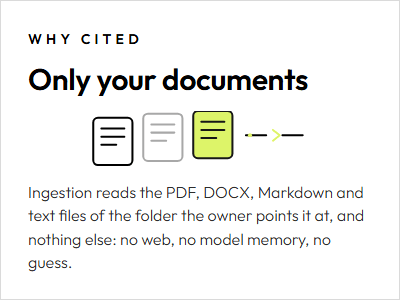</picture> | <picture><source media="(prefers-color-scheme: dark)" srcset="docs/images/reason-citations-dark.png">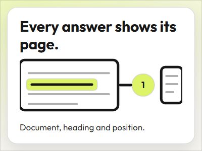</picture> | <picture><source media="(prefers-color-scheme: dark)" srcset="docs/images/reason-voice-dark.png">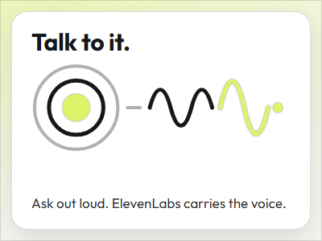</picture> |
|---|---|---|

1. **Solo tus documentos.** La ingesta lee los archivos que le señalas, y nada más: ni web, ni memoria del modelo,
   nada inventado.
2. **Cada pasaje conserva su fuente.** Documento, encabezado y posición viajan con el texto, así que quien lee puede
   abrir el documento y llegar al pasaje en lugar de confiar en un resumen.
3. **Háblale.** Cited responde con los pasajes que encontró y numera cada afirmación, por escrito y en voz alta: el
   micrófono del sitio público abre un agente de voz construido sobre los mismos documentos, y el dueño crea ese
   agente en un clic desde el panel.

## Estado

Cada fila está disponible hoy o planeada, y cada fila planeada nombra el cambio que la entrega.

| Capacidad | Estado | Especificación o cambio |
|---|---|---|
| Ingesta de PDF, DOCX, Markdown y texto con límites | Disponible | [knowledge-search](openspec/specs/knowledge-search/spec.md) |
| Búsqueda híbrida: texto completo y vectores, fusionados con Reciprocal Rank Fusion | Disponible | [knowledge-search](openspec/specs/knowledge-search/spec.md) |
| libSQL local o Turso, y embeddings por API u Ollama | Disponible | [knowledge-search](openspec/specs/knowledge-search/spec.md) |
| Respuestas con citas de cualquier proveedor de modelo, límites de gasto | Disponible | [answering](openspec/specs/answering/spec.md) |
| Las llaves de la IA en el panel, cifradas y probadas antes de guardarlas | Disponible | [provider-settings](openspec/specs/provider-settings/spec.md) |
| El panel: la configuración, el negocio, los documentos y las conversaciones | Disponible | [admin-panel](openspec/specs/admin-panel/spec.md) |
| La configuración guiada: de cero a una respuesta publicada en cuatro pasos | Disponible | [owner-setup](openspec/specs/owner-setup/spec.md) |
| Chat público del negocio, con el widget que cualquier sitio puede incrustar | Disponible | [public-chat](openspec/specs/public-chat/spec.md) |
| Agente de voz con ElevenLabs, creado en un clic | Disponible | [voice-agent](openspec/specs/voice-agent/spec.md) |
| Búsqueda y respuestas con cita desde tu propio agente, por MCP con token | Disponible | [mcp-server](openspec/specs/mcp-server/spec.md) |
| Design system compartido | Siguiente | `design-system-shared` |
| Endurecimiento de seguridad y pruebas de abuso | Siguiente | `security-hardening` |
| Despliegue en un clic, con imagen de Docker y documentación bilingüe | Siguiente | `docs-deploy-and-launch` |

## Cómo funciona

**De una carpeta de documentos a un pasaje citado.**

<picture><source media="(prefers-color-scheme: dark)" srcset="docs/images/how-it-works-dark.png">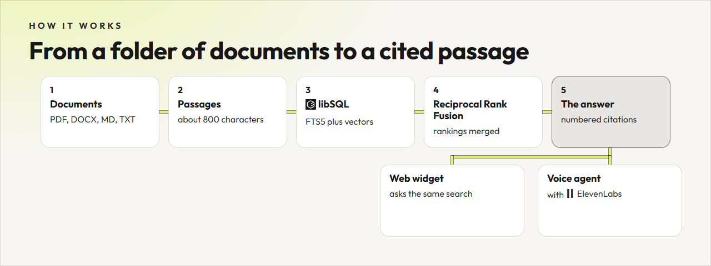</picture>

<details>
<summary>El mismo flujo como diagrama de texto</summary>

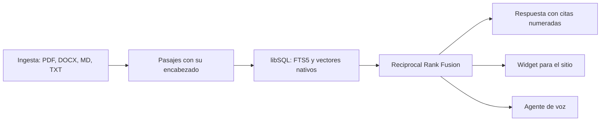

</details>

## Míralo funcionar

**Haz una pregunta. Recibe el pasaje y de dónde salió.**

<picture><source media="(prefers-color-scheme: dark)" srcset="docs/images/demo-dark.png">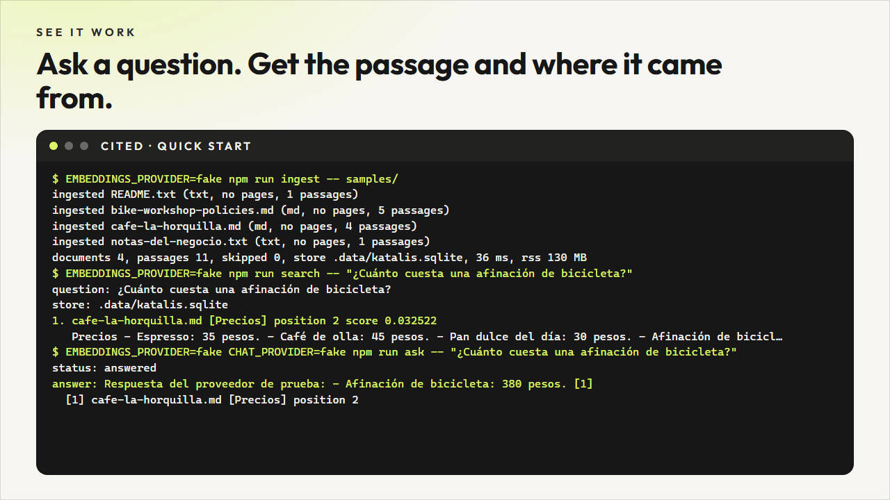</picture>

La imagen la dibuja `scripts/render-readme-graphics.mjs` con la salida de los comandos del arranque rápido, así que
no puede mostrar un resultado que el código no produzca: el mismo corpus, la misma búsqueda y la misma respuesta con
su cita.

**El chat público, como se ve hoy.** Esta no está dibujada: es una captura real de `/` con una pregunta respondida y la
cita abierta, tomada por `scripts/render-readme-captures.mjs` de la aplicación servida por `npm run start` con el
corpus de muestra, los proveedores deterministas y el negocio de muestra (Café La Horquilla, color `#1F5F4A`)
guardado en el panel, por eso el chat lleva su banda.

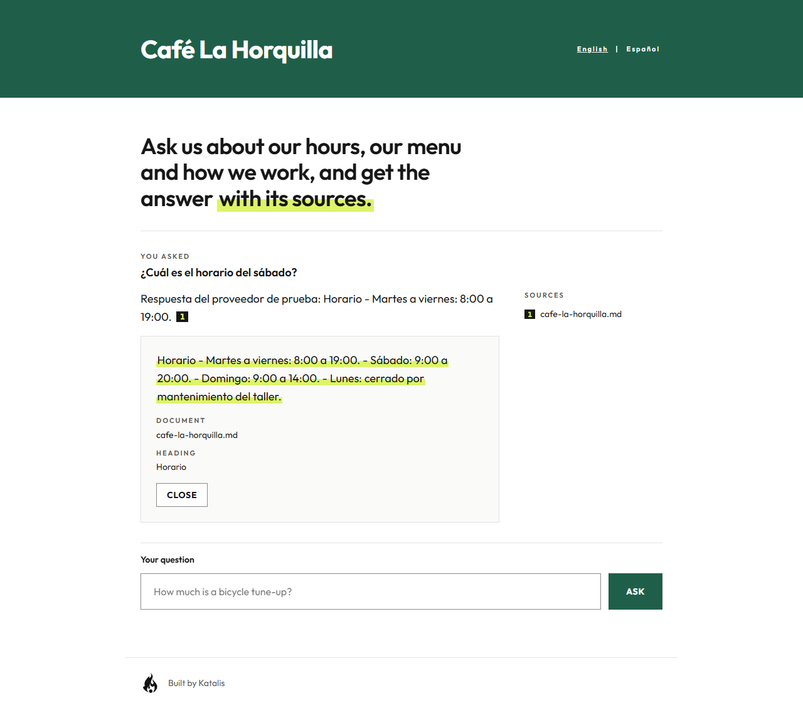

**Y el dueño lo maneja desde el navegador.** El panel de `/admin` lleva al dueño de la nada a una respuesta publicada
en cuatro pasos: conecta tu IA, agrega tu información, pruébalo, publícalo. Cada paso se abre en su lugar y se prueba
antes del siguiente, y el panel guarda el negocio, su logo y sus documentos. Abre en inglés, con el selector
`English | Español` en su encabezado, y lo sirve la misma aplicación que responde las preguntas.

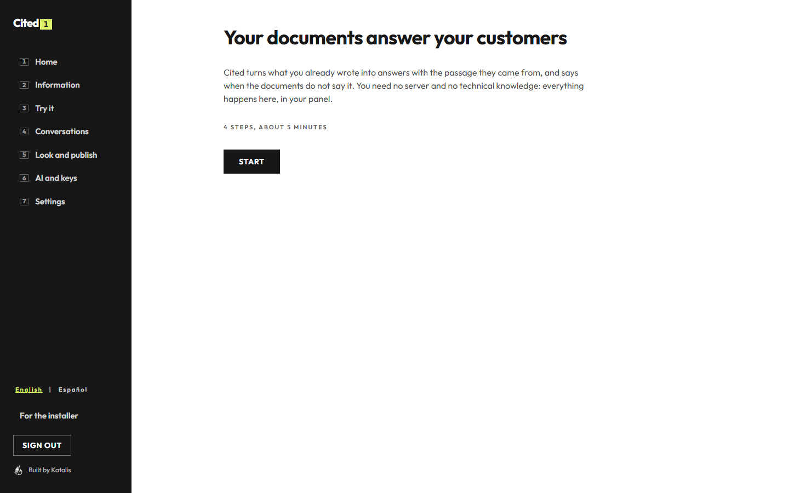

<picture>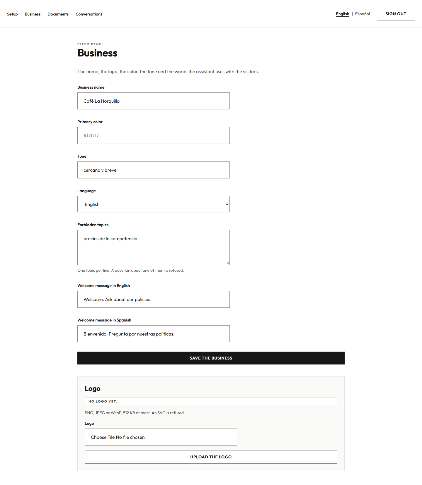</picture>

`docs/owner-guide.md` es el recorrido del dueño, paso a paso y en los dos idiomas, con las capturas de cada pantalla;
`docs/admin.md` explica las pantallas, las rutas, el store y las reglas del logo. Las dos capturas son corridas reales
de la aplicación construida, tomadas por la suite de extremo a extremo con los proveedores deterministas.

## Hoja de ruta

**Lo que corre hoy y lo que viene después.**

<picture><source media="(prefers-color-scheme: dark)" srcset="docs/images/roadmap-dark.png">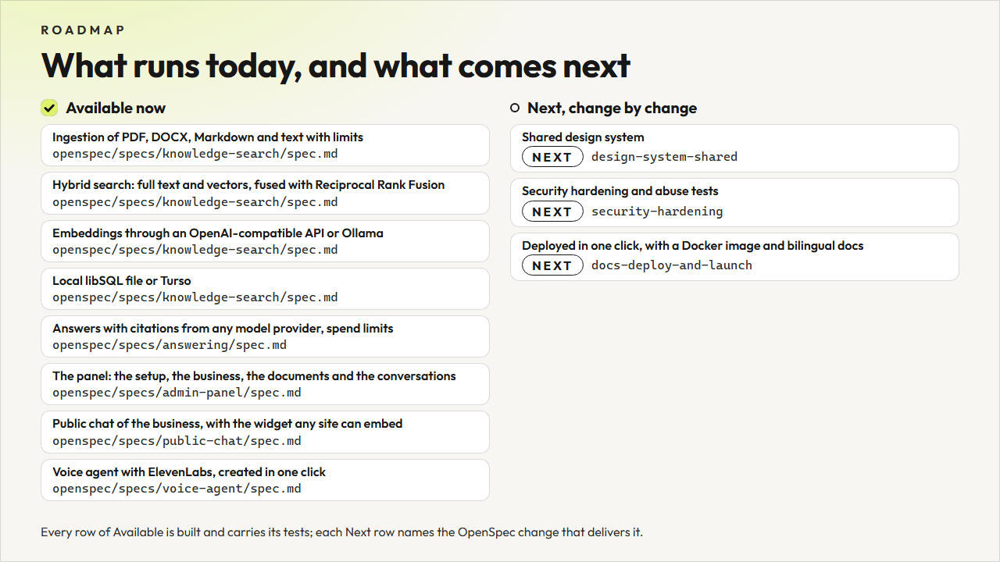</picture>

Los cambios del plan llegan en este orden: la voz con ElevenLabs, que ya está en el repositorio, luego el design
system compartido, luego el endurecimiento, luego los despliegues y la documentación.

## Voz

**Háblale a tus documentos.**

<picture><source media="(prefers-color-scheme: dark)" srcset="docs/images/voice-teaser-dark.png">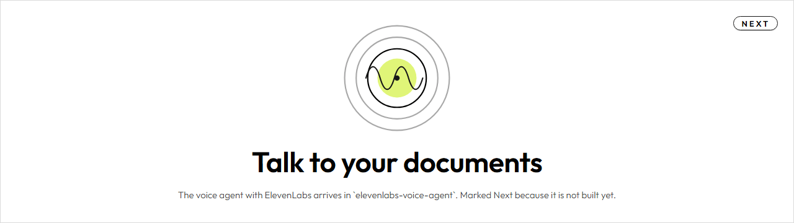</picture>

El botón del micrófono del sitio público y del widget abre el panel de voz: el Orb, el estado en palabras, la
transcripción en vivo con la pregunta escrita repetida una sola vez y las fichas de fuentes nombradas por documento y
sección. La sesión habla con el agente que el dueño crea con un botón del panel, y ese agente responde por
`/api/voice/tool` desde los mismos documentos y el mismo proceso que el chat escrito. La llave de ElevenLabs nunca
llega al navegador: el documento le pide a este servidor una URL firmada de quince minutos, y el día tiene un tope de
minutos. `docs/voice-agent.md` explica el agente de un clic, los dos idiomas, la lista de orígenes permitidos y el
tope.

La imagen de abajo es una captura real del panel a 1440 px, tomada por `scripts/render-voice-captures.mjs` sobre la
compilación del SDK de pruebas, que es la que maneja la suite de navegador:

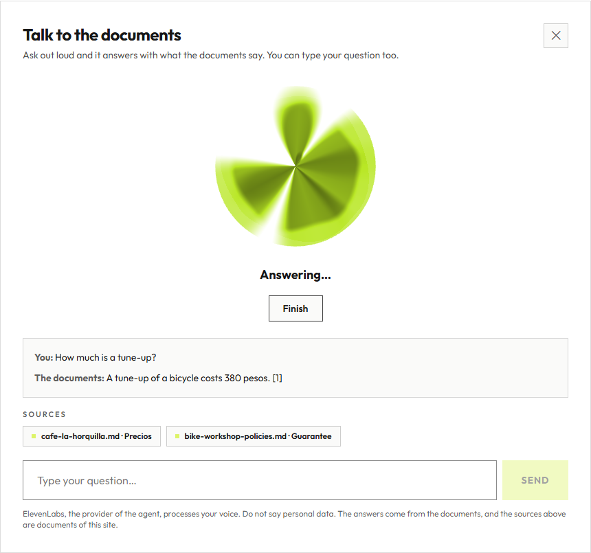

## Funciona con tu agente

Cited también es un servidor del Model Context Protocol, así que el agente que ya usas puede buscar en los documentos
del negocio y responder con ellos, con la misma negativa honesta cuando no tienen la respuesta.

```
CITED_MCP_TOKEN=<un token largo y aleatorio> npm start
```

<picture><source media="(prefers-color-scheme: dark)" srcset="docs/images/agents-es-dark.png">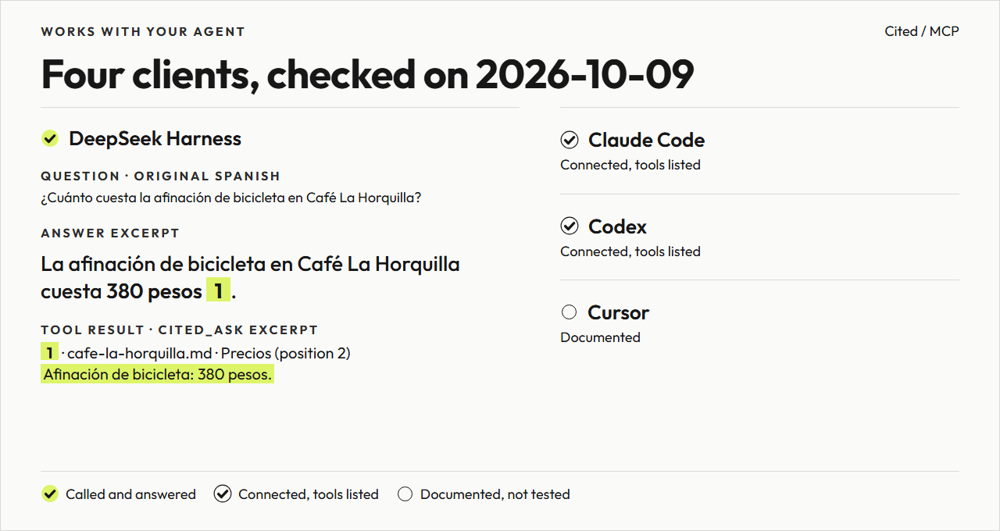</picture>

Expone dos herramientas de solo lectura. `cited_search` devuelve los pasajes con su documento, su sección, su posición
y su texto, y nunca llama a un modelo, así que una búsqueda no cuesta nada. `cited_ask` recorre el mismo camino que el
chat público y responde con citas numeradas, o con la negativa.

| Agente | Verificado el 2026-10-09 contra un Cited local |
|---|---|
| DeepSeek Harness (configuración MCP) | Llamó a `cited_search` y respondió con cita; [configuración](docs/mcp.md), [evidencia step-10-4](openspec/changes/archive/2026-10-09-mcp-server/reports/2026-10-09-step-10-4-review-and-clients.md). |
| DeepSeek Harness (plugin nativo) | Eligió `cited_ask` ante una pregunta natural en español y respondió con su propio pasaje citado; [transcripción](https://github.com/RonnieGex/dsh-cited/blob/main/docs/evidence/headless-answer.txt), [evidencia de compatibilidad](https://github.com/RonnieGex/dsh-cited/blob/main/docs/evidence/compatibility.md). |
| [Claude Code](https://docs.claude.com/en/docs/claude-code) | se conectó y listó las herramientas |
| [Codex](https://github.com/openai/codex) | se conectó y listó las herramientas |
| Cursor y cualquier otro cliente de Streamable HTTP | configuración documentada, todavía sin probar |

Instala el [plugin nativo](https://github.com/RonnieGex/dsh-cited) con `dsh plugin add github:RonnieGex/dsh-cited`.

`docs/mcp.md` trae la configuración exacta de cada uno y de `curl`. El token viaja en la cabecera
`Authorization: Bearer`, y el servidor está apagado hasta que lo declaras.

El gráfico conserva el primer párrafo exacto de la respuesta española y su fuente de `cited_ask`. El Markdown se muestra con formato; la [transcripción](https://github.com/RonnieGex/dsh-cited/blob/main/docs/evidence/headless-answer.txt) conserva todas las llamadas y la respuesta original completa. **3 de 3 preguntas en inglés recibieron una cita sustentada sobre la garantía** de un documento inglés. El lote anterior del ejemplo español obtuvo **2 de 3**, incluida una pregunta inglesa que no encontró el precio español; Cited se negó a responder y el agente afirmó, sin razón, que no existía el precio. La búsqueda por palabras clave, sin embeddings, puede no encontrar un pasaje español al preguntar en inglés. Los [resultados ingleses](https://github.com/RonnieGex/dsh-cited/blob/main/docs/evidence/natural-summary-en.json), los [del ejemplo español](https://github.com/RonnieGex/dsh-cited/blob/main/docs/evidence/natural-summary.json) y la [verificación](https://github.com/RonnieGex/dsh-cited/blob/main/docs/evidence/compatibility.md) documentan evidencia y límites.

## Arranque rápido

Dos comandos preparan el corpus y uno pide una respuesta. No hace falta ninguna llave: los proveedores deterministas
corren sin conexión.

```
git clone https://github.com/RonnieGex/cited.git
cd cited
npm ci
cp .env.example .env
EMBEDDINGS_PROVIDER=fake npm run ingest -- samples/
EMBEDDINGS_PROVIDER=fake npm run search -- "¿Cuánto cuesta una afinación de bicicleta?"
EMBEDDINGS_PROVIDER=fake CHAT_PROVIDER=fake npm run ask -- "¿Cuánto cuesta una afinación de bicicleta?"
npm run dev
```

La plantilla del entorno trae todos los valores vacíos a propósito, así que los tres comandos del corpus llevan delante
los proveedores deterministas: `fake` corre sin conexión y no necesita llave, ni para los embeddings ni para el chat.
Para conservarlo toda la sesión, escribe `EMBEDDINGS_PROVIDER=fake` y `CHAT_PROVIDER=fake` en `.env` una vez y
quítalos de los comandos. El último comando sirve la aplicación en `http://localhost:3000`, y `POST /api/ask` es la
misma respuesta por HTTP.

La salida de los tres comandos, sobre el corpus de ejemplo:

```
$ EMBEDDINGS_PROVIDER=fake npm run ingest -- samples/
ingested README.txt (txt, no pages, 1 passages)
ingested bike-workshop-policies.md (md, no pages, 5 passages)
ingested cafe-la-horquilla.md (md, no pages, 4 passages)
ingested notas-del-negocio.txt (txt, no pages, 1 passages)
documents 4, passages 11, skipped 0, store .data/katalis.sqlite, 30 ms, rss 130 MB
```

```
$ EMBEDDINGS_PROVIDER=fake npm run search -- "¿Cuánto cuesta una afinación de bicicleta?"
question: ¿Cuánto cuesta una afinación de bicicleta?
store: .data/katalis.sqlite
1. cafe-la-horquilla.md [Precios] position 2 score 0.032522
   Precios - Espresso: 35 pesos. - Café de olla: 45 pesos. - Pan dulce del día: 30 pesos. - Afinación de bicicleta: 380 pesos. - Cambio de cámara: 120 pesos.
2. cafe-la-horquilla.md [Políticas] position 3 score 0.032522
   Políticas Aceptamos efectivo y tarjeta. El taller recibe bicicletas hasta una hora antes del cierre. Si una reparación necesita refacciones, avisamos por teléfono antes de empezar.
3. notas-del-negocio.txt [no heading] position 0 score 0.031746
   Café La Horquilla — notas del negocio Dirección: avenida central, frente al parque. Sin estacionamiento propio, pero hay uno público a media cuadra. Formas de pago: efectivo, tarjeta de débito y crédito. No aceptamos cheques ni transferenci
4. cafe-la-horquilla.md [Café La Horquilla] position 0 score 0.030331
   Café La Horquilla Somos un café y taller de bicicletas en el centro de la ciudad. Abrimos de martes a domingo.
5. bike-workshop-policies.md [Guarantee] position 4 score 0.015625
   Guarantee Every repair carries a 90 day guarantee on the work. Parts carry the guarantee of their maker. Bring the ticket; without it we can still look up the repair by the frame number.
6. bike-workshop-policies.md [Bookings and cancellations] position 1 score 0.015385
   Bookings and cancellations A repair booking is free. Cancel or move your appointment at least 24 hours before the agreed time and there is no charge. A late cancellation costs 50 pesos, and a dropped appointment costs the full estimate.
7. bike-workshop-policies.md [Groups and events] position 3 score 0.015152
   Groups and events We host a Saturday ride that leaves the shop at 9:30. Groups of more than 8 people should write to us a week ahead so we can arrange a mechanic and a second guide.
8. bike-workshop-policies.md [Bike workshop policies at Café La Horquilla] position 0 score 0.014925
   Bike workshop policies at Café La Horquilla Everything a customer needs to know before leaving a bicycle with us.
8 results, 4 ms, rss 94 MB
```

```
$ EMBEDDINGS_PROVIDER=fake CHAT_PROVIDER=fake npm run ask -- "¿Cuánto cuesta una afinación de bicicleta?"
question: ¿Cuánto cuesta una afinación de bicicleta?
store: .data/katalis.sqlite
status: answered
answer: Respuesta del proveedor de prueba: - Afinación de bicicleta: 380 pesos. [1]
citations:
  [1] cafe-la-horquilla.md [Precios] position 2 lead 0
      Precios - Espresso: 35 pesos. - Café de olla: 45 pesos. - Pan dulce del día: 30 pesos. - Afinación de bicicleta: 380 pesos. - Cambio de cámara: 120 pesos.
citations 1, 38 ms, rss 102 MB
```

El almacén vive en `.data/katalis.sqlite`, que git ignora. `docs/search.md` explica el esquema, el troceado y el
ordenamiento, y `docs/answering.md` el prompt, las citas, los proveedores y los guardas.

### Requisitos

- Node 24, nunca anterior a 24.15 (`.nvmrc`, `engines`)
- npm 11 o superior
- gitleaks para el gancho de commit y Chromium de Playwright para las pruebas de navegador, solo si contribuyes

## Configuración

Las variables que el dueño define, para qué sirve cada una y si el código la lee hoy.

| Variable | Para qué sirve | Se lee hoy |
|---|---|---|
| `EMBEDDINGS_PROVIDER` | el proveedor de embeddings: `openai`, `ollama` o `fake` | sí |
| `EMBEDDINGS_BASE_URL` | URL base de la API de embeddings compatible con OpenAI | sí |
| `EMBEDDINGS_MODEL` | nombre del modelo de embeddings | sí |
| `EMBEDDINGS_API_KEY` | llave del proveedor de embeddings | sí |
| `EMBEDDINGS_DIMENSIONS` | ajuste opcional del tamaño del vector del proveedor | sí |
| `OLLAMA_BASE_URL` | URL base de un Ollama local, `http://localhost:11434` por defecto | sí |
| `DATABASE_URL` | ruta del archivo libSQL local, `.data/katalis.sqlite` por defecto | sí |
| `TURSO_DATABASE_URL` | URL de una base libSQL remota; gana sobre el archivo local | sí |
| `TURSO_AUTH_TOKEN` | token de la base remota, obligatorio cuando la URL es remota | sí |
| `CHAT_PROVIDER` | el proveedor de chat de las respuestas: `openai`, `anthropic`, `gemini`, `deepseek`, `groq`, `openrouter`, `ollama`, `lmstudio` o `fake` | sí |
| `CHAT_MODEL` | modelo opcional del proveedor de chat; sin él cada uno usa su default | sí |
| `OPENAI_API_KEY`, `ANTHROPIC_API_KEY`, `GEMINI_API_KEY`, `DEEPSEEK_API_KEY`, `GROQ_API_KEY`, `OPENROUTER_API_KEY` | la llave del proveedor de chat elegido, y de ningún otro | sí |
| `LMSTUDIO_BASE_URL` | URL base de un LM Studio local, `http://localhost:1234/v1` por defecto | sí |
| `OPENAI_BASE_URL`, `ANTHROPIC_BASE_URL`, `GEMINI_BASE_URL`, `DEEPSEEK_BASE_URL`, `GROQ_BASE_URL`, `OPENROUTER_BASE_URL` | opcional: apunta un proveedor a un endpoint compatible tuyo, una pasarela o un proxy; vacío mantiene su dirección publicada | sí |
| `ENCRYPTION_KEY` | la llave que cifra las llaves que el dueño pega en el panel: 32 bytes en base64, y sin ella el panel no guarda ninguna | sí |
| `PROVIDER_TEST_TIMEOUT_MS` | lo que espera la prueba de un proveedor antes de decir que tardó demasiado, diez segundos por defecto | sí |
| `AFFILIATE_LINKS` | `off` convierte cada enlace de afiliado del catálogo de proveedores en su enlace simple | sí |
| `HOSTED_OFFER_URL` | dirección de la versión hospedada de Katalis que el panel ofrece bajo la lista de proveedores | sí |
| `MAX_QUESTION_CHARS` | la pregunta más larga que acepta la ruta, 1000 caracteres por defecto | sí |
| `RATE_LIMIT_PER_IP_PER_HOUR` | las preguntas que una dirección puede hacer en una hora, 30 por defecto | sí |
| `DAILY_MODEL_CALL_LIMIT` | las llamadas al modelo de un día UTC, 500 por defecto | sí |
| `MAX_ANSWER_TOKENS` | el techo de tokens de una respuesta, 600 por defecto | sí |
| `CONVERSATION_RETENTION_DAYS` | los días que se guarda una conversación, 30 por defecto | sí |
| `TRUST_PROXY` | el número de proxies delante: `1` para Traefik solo, `2` para una CDN delante de Traefik; la dirección del visitante es esa cantidad de lugares desde la derecha de `x-forwarded-for`, y sin él la cabecera no se confía | sí |
| `ADMIN_SESSION_SECRET` | secreto que sala el hash de la dirección del visitante y firma la sesión del panel | sí |
| `ADMIN_PASSWORD` | contraseña del panel, la que abre `/admin` | sí |
| `VOICE_TOOL_SECRET` | secreto que la herramienta de voz espera en su token Bearer | sí |
| `ELEVENLABS_API_KEY`, `ELEVENLABS_AGENT_ID` | la voz con ElevenLabs: la llave del dueño y, si quieres, el agente que fija | sí |
| `ELEVENLABS_VOICE_ID` | voz opcional del agente de voz; sin ella, la voz predeterminada de la cuenta | no |
| `DAILY_VOICE_MINUTE_LIMIT` | los minutos de voz de un día UTC, 30 por omisión | sí |
| `EMBEDDING_MODEL`, `EMBEDDING_API_KEY` | dos nombres que la plantilla reserva y ningún código lee: la búsqueda usa `EMBEDDINGS_MODEL` y `EMBEDDINGS_API_KEY` | no |
| `ALLOWED_ORIGINS` | orígenes permitidos para incrustar el widget, separados por comas; solo su propio origen cuando está vacío | sí |

Una fila marcada `no` es un nombre que el repositorio ya reserva y que ningún código lee todavía. Ninguna llave tiene
valor en este repositorio, y git ignora `.env`.

## Seguridad

Las llaves viven solo en el entorno del servidor. Nunca llegan al navegador y nunca se guardan en la base de datos. El
modelo de amenazas es `docs/security.md`; una vulnerabilidad se reporta en privado, como dice `SECURITY.md`, nunca en
un issue público. El repositorio no lleva ningún archivo de fuente con licencia comercial desde su primer commit.

## Cómo contribuir

Cited se especifica antes de programarse: cada cambio es un cambio de OpenSpec con su propuesta, sus deltas de
especificación, su diseño y su lista de tareas con evidencia. Lee `docs/katalis-sdd-standard.md` y
`docs/openspec-tasks-mandatory-steps.md`, y luego `CONTRIBUTING.md`.

Antes de un pull request, corre las mismas comprobaciones que corre la pipeline:

```
npm run typecheck
npm run lint
npm test
npm run build
npm run test:e2e
npm run audit:high
npm run secrets:scan
npm run openspec:validate
```

## Licencia

Apache-2.0, con un archivo [LICENSE](LICENSE) y un archivo [NOTICE](NOTICE) que lleva la atribución. Un fork conserva
el aviso.

<br>

<p align="center">
  <picture><source media="(prefers-color-scheme: dark)" srcset="public/brand/katalis-flame-192.png"></picture>
  <a href="https://katalis.dev">Hecho por Katalis</a>
</p>
