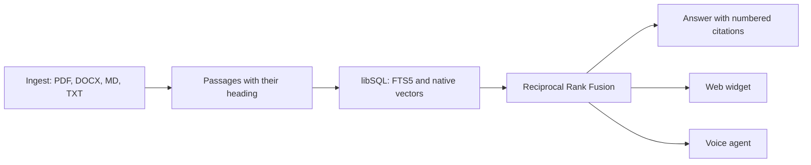
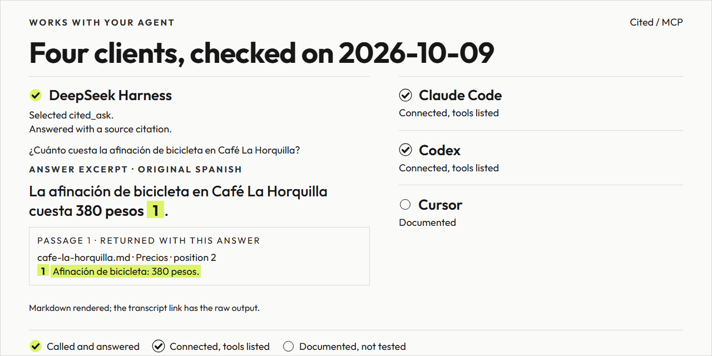

<h1 align="center">
  <picture>
    <source media="(prefers-color-scheme: dark)" srcset="docs/images/readme-banner-dark.png">
    
  </picture>
</h1>

<p align="center">Ask your own documents. Get the passage and where it came from.</p>

[](LICENSE)
[](package.json)
[](package.json)
[](https://www.typescriptlang.org/)
[](https://github.com/tursodatabase/libsql)

[](https://github.com/RonnieGex/cited/actions/workflows/ci.yml)

[English](README.md) · [Español](README.es.md)

**Cited is in early development and not ready for production.** What you can run today is the core: it turns a
folder of documents into citable passages, finds them again with a hybrid search and answers with the passages it
found, every claim numbered as a citation. Read the [status table](#status) before you promise anything to anyone.

## Why Cited

| <picture><source media="(prefers-color-scheme: dark)" srcset="docs/images/reason-sources-dark.png"></picture> | <picture><source media="(prefers-color-scheme: dark)" srcset="docs/images/reason-citations-dark.png"></picture> | <picture><source media="(prefers-color-scheme: dark)" srcset="docs/images/reason-voice-dark.png"></picture> |
|---|---|---|

1. **Only your documents.** Ingestion reads the files you point it at, and nothing else: no web, no model memory,
   nothing invented.
2. **Every passage keeps its source.** Document, heading and position travel with the text, so a reader can open the
   document and land on the passage instead of trusting a summary.
3. **Talk to it.** Cited answers with the passages it found and numbers every claim, in writing and out loud: the
   microphone of the public site opens a voice agent built on the same documents, and the owner creates that agent in
   one click from the panel.

## Status

Every row is either available today or planned, and each planned row names the change that delivers it.

| Capability | State | Spec or change |
|---|---|---|
| Ingestion of PDF, DOCX, Markdown and text with limits | Available | [knowledge-search](openspec/specs/knowledge-search/spec.md) |
| Hybrid search: full text and vectors, fused with Reciprocal Rank Fusion | Available | [knowledge-search](openspec/specs/knowledge-search/spec.md) |
| Local libSQL or Turso, and embeddings by API or Ollama | Available | [knowledge-search](openspec/specs/knowledge-search/spec.md) |
| Answers with citations from any model provider, spend limits | Available | [answering](openspec/specs/answering/spec.md) |
| The keys of the AI in the panel, encrypted and tested before saving | Available | [provider-settings](openspec/specs/provider-settings/spec.md) |
| The panel: the setup, the business, the documents and the conversations | Available | [admin-panel](openspec/specs/admin-panel/spec.md) |
| The guided setup: from zero to a published answer in four steps | Available | [owner-setup](openspec/specs/owner-setup/spec.md) |
| Public chat of the business, with the widget any site can embed | Available | [public-chat](openspec/specs/public-chat/spec.md) |
| Voice agent with ElevenLabs, created in one click | Available | [voice-agent](openspec/specs/voice-agent/spec.md) |
| Search and cited answers from your own agent, over MCP with a token | Available | [mcp-server](openspec/specs/mcp-server/spec.md) |
| Shared design system | Planned | `design-system-shared` |
| Security hardening and abuse tests | Planned | `security-hardening` |
| Deployed in one click, with a Docker image and bilingual docs | Planned | `docs-deploy-and-launch` |

## How it works

**From a folder of documents to a cited passage.**

<picture><source media="(prefers-color-scheme: dark)" srcset="docs/images/how-it-works-dark.png"></picture>

<details>
<summary>The same flow as a text diagram</summary>



</details>

## See it work

**Ask a question. Get the passage and where it came from.**

<picture><source media="(prefers-color-scheme: dark)" srcset="docs/images/demo-dark.png"></picture>

The image is drawn by `scripts/render-readme-graphics.mjs` from the output of the commands in the quick start, so it
cannot show a result the code does not produce: the same corpus, the same search and the same answer with its
citation.

**The public chat, as it looks today.** This one is not drawn: it is a real capture of `/` with a question answered and
the citation open, taken by `scripts/render-readme-captures.mjs` from the application served by `npm run start` with
the sample corpus, the deterministic providers and the sample business (Café La Horquilla, color `#1F5F4A`) saved in the
panel, so the chat wears its band.


**And the owner manages it from the browser.** The panel of `/admin` walks the owner from nothing to a published
answer in four steps: connect your AI, add your information, try it, publish it. Each step opens in its place and
proves itself before the next, and the panel stores the business, its logo and its documents. It opens in English, with
the switch `English | Español` in its header, and it is served by the same application as the questions.


<picture></picture>

`docs/owner-guide.md` is the walk of the owner, step by step and in both languages, with the captures of every screen;
`docs/admin.md` explains the screens, the routes, the store and the rules of the logo. Both captures are real runs of
the built application, taken by the end-to-end suite with the deterministic providers.

## Roadmap

**What runs today, and what comes next.**

<picture><source media="(prefers-color-scheme: dark)" srcset="docs/images/roadmap-dark.png"></picture>

The changes of the plan arrive in this order: the voice with ElevenLabs, already in the repository, then the shared
design system, then the hardening, then the deploys and the docs.

## Voice

**Talk to your documents.**

<picture><source media="(prefers-color-scheme: dark)" srcset="docs/images/voice-teaser-dark.png"></picture>

The microphone button of the public site and of the widget opens the voice panel: the Orb, the state in words, the live
transcript with the written question echoed once, and the citation chips named by document and section. The session
speaks to the agent the owner creates with one button of the panel, and that agent answers through
`/api/voice/tool` from the same documents and the same pipeline as the written chat. The key of ElevenLabs never
reaches the browser: the document asks this server for a signed URL of fifteen minutes, and the day has a cap of
minutes. `docs/voice-agent.md` explains the one-click agent, the two languages, the allowlist and the cap.

The picture below is a real capture of the panel at 1440 px, taken by `scripts/render-voice-captures.mjs` over the
build of the test SDK, which is the build the browser suite drives:


## Works with your agent

<picture><source media="(prefers-color-scheme: dark)" srcset="docs/images/agents-dark.png"></picture>

The graphic quotes the exact first paragraph of the answer from the [natural plugin run](https://github.com/RonnieGex/dsh-cited/blob/main/docs/evidence/headless-answer.txt) in its original Spanish, with the passage returned by its own `cited_ask` call, and summarizes the [recorded client verification](openspec/changes/archive/2026-10-09-mcp-server/reports/2026-10-09-step-10-4-review-and-clients.md). The same run also called `cited_search`; the transcript keeps every call and the complete final answer. Markdown rendered; the transcript link has the raw output.

**2 of 3 natural questions received a supported price citation** with keyword search and no embeddings; English questions over Spanish documents can miss the passage, as the English question did in this round. After the English refusal, the agent falsely claimed that the price was absent. [All three outcomes](https://github.com/RonnieGex/dsh-cited/blob/main/docs/evidence/natural-summary.json). The Harness agent used `deepseek-official / deepseek-v4-flash`; Cited answered with `deepseek / deepseek-v4-flash`, verified from the capture server's startup configuration.

Cited is also a server of the Model Context Protocol, so the agent you already use can search the documents of the
business and answer from them, with the same honest refusal when they do not hold the answer.

```
CITED_MCP_TOKEN=<a long random token> npm start
```

Two read-only tools are exposed. `cited_search` returns the passages with their document, their section, their position
and their text, and it never calls a model, so a search spends nothing. `cited_ask` walks the same pipeline as the
public chat and answers with numbered citations, or with the refusal.

| Agent | Verified on 2026-10-09 against a local Cited |
|---|---|
| DeepSeek Harness (MCP configuration) | Called `cited_search` and answered with a citation; [configuration](docs/mcp.md), [step-10-4 evidence](openspec/changes/archive/2026-10-09-mcp-server/reports/2026-10-09-step-10-4-review-and-clients.md). |
| DeepSeek Harness (native plugin) | Selected `cited_ask` for a natural Spanish question and answered with its own cited passage; [transcript](https://github.com/RonnieGex/dsh-cited/blob/main/docs/evidence/headless-answer.txt), [compatibility evidence](https://github.com/RonnieGex/dsh-cited/blob/main/docs/evidence/compatibility.md). |
| [Claude Code](https://docs.claude.com/en/docs/claude-code) | it connected and listed the tools |
| [Codex](https://github.com/openai/codex) | it connected and listed the tools |
| Cursor and any other client of Streamable HTTP | configuration documented, not tested yet |

Install the [native plugin](https://github.com/RonnieGex/dsh-cited) with `dsh plugin add github:RonnieGex/dsh-cited`.

`docs/mcp.md` carries the exact configuration for each one and for `curl`. The token travels in the
`Authorization: Bearer` header, and the server is off until you declare it.

## Quick start

Two commands prepare the corpus and one asks for an answer. No key is needed: the deterministic providers run
offline.

```
git clone https://github.com/RonnieGex/cited.git
cd cited
npm ci
cp .env.example .env
EMBEDDINGS_PROVIDER=fake npm run ingest -- samples/
EMBEDDINGS_PROVIDER=fake npm run search -- "¿Cuánto cuesta una afinación de bicicleta?"
EMBEDDINGS_PROVIDER=fake CHAT_PROVIDER=fake npm run ask -- "¿Cuánto cuesta una afinación de bicicleta?"
npm run dev
```

The template of the environment has every value empty on purpose, so the three commands of the corpus carry the
deterministic providers in front: `fake` runs offline and needs no key, for the embeddings and for the chat. To keep
it for the whole session, write `EMBEDDINGS_PROVIDER=fake` and `CHAT_PROVIDER=fake` in `.env` once and drop them from
the commands. The last command serves the app on `http://localhost:3000`, and `POST /api/ask` is the same answer over
HTTP.

The output of the three commands, on the sample corpus:

```
$ EMBEDDINGS_PROVIDER=fake npm run ingest -- samples/
ingested README.txt (txt, no pages, 1 passages)
ingested bike-workshop-policies.md (md, no pages, 5 passages)
ingested cafe-la-horquilla.md (md, no pages, 4 passages)
ingested notas-del-negocio.txt (txt, no pages, 1 passages)
documents 4, passages 11, skipped 0, store .data/katalis.sqlite, 30 ms, rss 130 MB
```

```
$ EMBEDDINGS_PROVIDER=fake npm run search -- "¿Cuánto cuesta una afinación de bicicleta?"
question: ¿Cuánto cuesta una afinación de bicicleta?
store: .data/katalis.sqlite
1. cafe-la-horquilla.md [Precios] position 2 score 0.032522
   Precios - Espresso: 35 pesos. - Café de olla: 45 pesos. - Pan dulce del día: 30 pesos. - Afinación de bicicleta: 380 pesos. - Cambio de cámara: 120 pesos.
2. cafe-la-horquilla.md [Políticas] position 3 score 0.032522
   Políticas Aceptamos efectivo y tarjeta. El taller recibe bicicletas hasta una hora antes del cierre. Si una reparación necesita refacciones, avisamos por teléfono antes de empezar.
3. notas-del-negocio.txt [no heading] position 0 score 0.031746
   Café La Horquilla — notas del negocio Dirección: avenida central, frente al parque. Sin estacionamiento propio, pero hay uno público a media cuadra. Formas de pago: efectivo, tarjeta de débito y crédito. No aceptamos cheques ni transferenci
4. cafe-la-horquilla.md [Café La Horquilla] position 0 score 0.030331
   Café La Horquilla Somos un café y taller de bicicletas en el centro de la ciudad. Abrimos de martes a domingo.
5. bike-workshop-policies.md [Guarantee] position 4 score 0.015625
   Guarantee Every repair carries a 90 day guarantee on the work. Parts carry the guarantee of their maker. Bring the ticket; without it we can still look up the repair by the frame number.
6. bike-workshop-policies.md [Bookings and cancellations] position 1 score 0.015385
   Bookings and cancellations A repair booking is free. Cancel or move your appointment at least 24 hours before the agreed time and there is no charge. A late cancellation costs 50 pesos, and a dropped appointment costs the full estimate.
7. bike-workshop-policies.md [Groups and events] position 3 score 0.015152
   Groups and events We host a Saturday ride that leaves the shop at 9:30. Groups of more than 8 people should write to us a week ahead so we can arrange a mechanic and a second guide.
8. bike-workshop-policies.md [Bike workshop policies at Café La Horquilla] position 0 score 0.014925
   Bike workshop policies at Café La Horquilla Everything a customer needs to know before leaving a bicycle with us.
8 results, 4 ms, rss 94 MB
```

```
$ EMBEDDINGS_PROVIDER=fake CHAT_PROVIDER=fake npm run ask -- "¿Cuánto cuesta una afinación de bicicleta?"
question: ¿Cuánto cuesta una afinación de bicicleta?
store: .data/katalis.sqlite
status: answered
answer: Respuesta del proveedor de prueba: - Afinación de bicicleta: 380 pesos. [1]
citations:
  [1] cafe-la-horquilla.md [Precios] position 2 lead 0
      Precios - Espresso: 35 pesos. - Café de olla: 45 pesos. - Pan dulce del día: 30 pesos. - Afinación de bicicleta: 380 pesos. - Cambio de cámara: 120 pesos.
citations 1, 38 ms, rss 102 MB
```

The store lives in `.data/katalis.sqlite`, which git ignores. `docs/search.md` explains the schema, the chunking and
the ranking, and `docs/answering.md` the prompt, the citations, the providers and the guards.

### Requirements

- Node 24, never older than 24.15 (`.nvmrc`, `engines`)
- npm 11 or newer
- gitleaks for the commit hook, and Playwright Chromium for the browser tests, only if you contribute

## Configuration

The variables the owner sets, what each one is for, and whether the code reads it today.

| Variable | What it is for | Read today |
|---|---|---|
| `EMBEDDINGS_PROVIDER` | the embeddings provider: `openai`, `ollama` or `fake` | yes |
| `EMBEDDINGS_BASE_URL` | base URL of the OpenAI-compatible embeddings API | yes |
| `EMBEDDINGS_MODEL` | name of the embeddings model | yes |
| `EMBEDDINGS_API_KEY` | key of the embeddings provider | yes |
| `EMBEDDINGS_DIMENSIONS` | optional override of the vector size of the provider | yes |
| `OLLAMA_BASE_URL` | base URL of a local Ollama, `http://localhost:11434` by default | yes |
| `DATABASE_URL` | path of the local libSQL file, `.data/katalis.sqlite` by default | yes |
| `TURSO_DATABASE_URL` | URL of a remote libSQL database; it wins over the local file | yes |
| `TURSO_AUTH_TOKEN` | token of the remote database, required when the URL is remote | yes |
| `CHAT_PROVIDER` | the chat provider of the answers: `openai`, `anthropic`, `gemini`, `deepseek`, `groq`, `openrouter`, `ollama`, `lmstudio` or `fake` | yes |
| `CHAT_MODEL` | optional model of the chat provider; without it each one uses its default | yes |
| `OPENAI_API_KEY`, `ANTHROPIC_API_KEY`, `GEMINI_API_KEY`, `DEEPSEEK_API_KEY`, `GROQ_API_KEY`, `OPENROUTER_API_KEY` | the key of the chosen chat provider, and of no other | yes |
| `LMSTUDIO_BASE_URL` | base URL of a local LM Studio, `http://localhost:1234/v1` by default | yes |
| `OPENAI_BASE_URL`, `ANTHROPIC_BASE_URL`, `GEMINI_BASE_URL`, `DEEPSEEK_BASE_URL`, `GROQ_BASE_URL`, `OPENROUTER_BASE_URL` | optional: point a provider at a compatible endpoint of your own, a gateway or a proxy; an empty value keeps its published address | yes |
| `ENCRYPTION_KEY` | the key that encrypts the keys the owner pastes in the panel: 32 bytes in base64, and without it the panel stores none | yes |
| `PROVIDER_TEST_TIMEOUT_MS` | how long the test of a provider waits before it says it took too long, ten seconds by default | yes |
| `AFFILIATE_LINKS` | `off` turns every affiliate link of the provider catalogue into its plain link | yes |
| `HOSTED_OFFER_URL` | address of the hosted version of Katalis that the panel offers under the list of providers | yes |
| `MAX_QUESTION_CHARS` | the longest question the route accepts, 1000 characters by default | yes |
| `RATE_LIMIT_PER_IP_PER_HOUR` | the questions one address may ask in an hour, 30 by default | yes |
| `DAILY_MODEL_CALL_LIMIT` | the model calls of one UTC day, 500 by default | yes |
| `MAX_ANSWER_TOKENS` | the token ceiling of one answer, 600 by default | yes |
| `CONVERSATION_RETENTION_DAYS` | the days a conversation is kept, 30 by default | yes |
| `TRUST_PROXY` | the number of proxies in front: `1` for Traefik alone, `2` for a CDN in front of Traefik; the visitor address is that many places from the right of `x-forwarded-for`, and without it the header is not trusted | yes |
| `ADMIN_SESSION_SECRET` | secret that salts the hash of the visitor address and signs the session of the panel | yes |
| `ADMIN_PASSWORD` | password of the panel, the one that opens `/admin` | yes |
| `VOICE_TOOL_SECRET` | secret the voice tool expects in its Bearer token | yes |
| `ELEVENLABS_API_KEY`, `ELEVENLABS_AGENT_ID` | the voice with ElevenLabs: the key of the owner and, optionally, the agent it pins | yes |
| `ELEVENLABS_VOICE_ID` | optional voice of the voice agent; without it the default voice of the account | no |
| `EMBEDDING_MODEL`, `EMBEDDING_API_KEY` | two names the template reserves and no code reads: the search takes `EMBEDDINGS_MODEL` and `EMBEDDINGS_API_KEY` | no |
| `DAILY_VOICE_MINUTE_LIMIT` | the voice minutes of one UTC day, 30 by default | yes |
| `ALLOWED_ORIGINS` | origins allowed to embed the widget, comma separated; only its own origin when it is empty | yes |

A row marked `no` is a name the repository already reserves and no code reads yet. No key has a value in this
repository, and `.env` is ignored by git.

## Security

Keys live only in the environment of the server. They never reach the browser and they are never stored in the
database. The threat model is `docs/security.md`; a vulnerability is reported privately, as `SECURITY.md` says, never
in a public issue. The repository has carried no commercially licensed font file since its first commit.

## Contributing

Cited is specified before it is coded: every change is an OpenSpec change with a proposal, its spec deltas, a design
and a task list with its evidence. Read `docs/katalis-sdd-standard.md` and
`docs/openspec-tasks-mandatory-steps.md`, then `CONTRIBUTING.md`.

Before a pull request, run the same checks the pipeline runs:

```
npm run typecheck
npm run lint
npm test
npm run build
npm run test:e2e
npm run audit:high
npm run secrets:scan
npm run openspec:validate
```

## License

Apache-2.0, with a [LICENSE](LICENSE) file and a [NOTICE](NOTICE) file that carries the attribution. A fork keeps the
notice.

<br>

<p align="center">
  <picture><source media="(prefers-color-scheme: dark)" srcset="public/brand/katalis-flame-192.png"></picture>
  <a href="https://katalis.dev">Built by Katalis</a>
</p>
