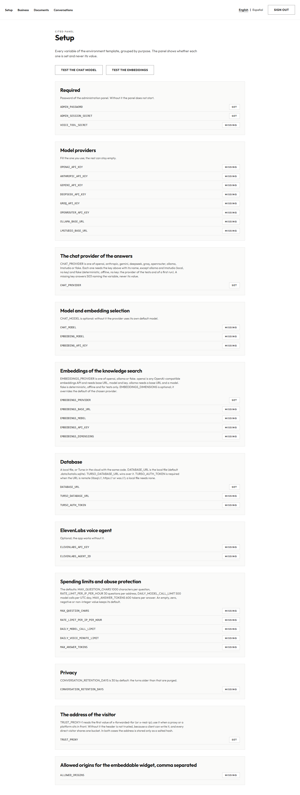
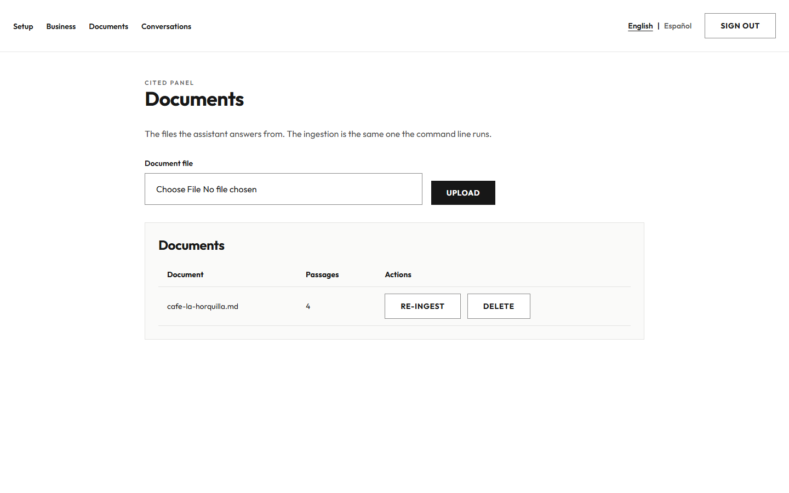
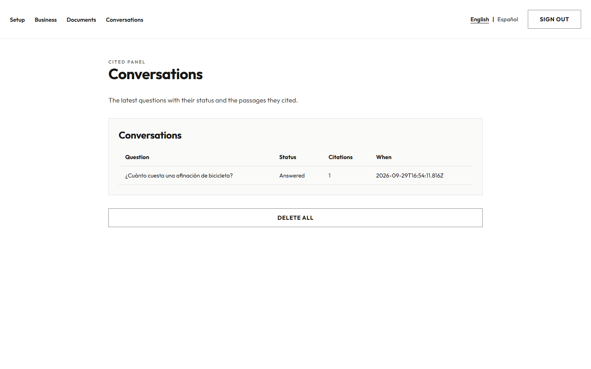

# The panel

The panel is the place where the owner of a fork sees what is configured, describes the business and manages the
documents the assistant answers from, without touching the terminal. It is served by the same application as the
public questions: one process, one store.

```
ADMIN_PASSWORD=una-clave-larga
ADMIN_SESSION_SECRET=un-secreto-largo
EMBEDDINGS_PROVIDER=fake
CHAT_PROVIDER=fake
npm run dev
```

The panel lives in `/admin`. Without `ADMIN_PASSWORD` or `ADMIN_SESSION_SECRET` it refuses to start with `503` and
names the variable that is missing; it never shows a value of the environment, only whether it is set.

## Pages

| Page | What it does |
|---|---|
| `/admin` | the setup: every variable of `.env.example` grouped by purpose, as `Set` or `Missing`, with one button that makes one small call to the chat model and one to the embeddings and reports what the provider answered |
| `/admin/business` | the name, the logo, the primary color, the tone, the language, the forbidden topics and the welcome message in English and in Spanish |
| `/admin/documents` | the upload, the list of every document with its passages, the re-ingestion and the delete |
| `/admin/conversations` | the latest questions with their status and their citations, and the button that deletes them all |

| The setup | The business |
|---|---|
|  |  |

| The documents | The conversations |
|---|---|
|  |  |

## The session

`POST /api/admin/login` takes `{"password": string}` and answers with the cookie `cited_admin`, which holds
`expiry.signature`: the expiry in milliseconds and an HMAC-SHA256 of that expiry signed with `ADMIN_SESSION_SECRET`.
The cookie is `Path=/`, `HttpOnly`, `SameSite=Strict`, twelve hours long, and `Secure` outside `localhost`. The
password is compared in constant time, over the SHA-256 of both sides, so the comparison leaks neither the content
nor the length. `POST /api/admin/logout` clears the cookie.

Five failed attempts from one address within fifteen minutes lock that address for fifteen minutes: the sixth
attempt answers `429` with `Retry-After`, even when it carries the right password. The failures live in the store, in
`login_attempts(ip_hash, window_start, count)`, with the same salted hash of the address the public questions use, so
no address is kept in clear. A successful login clears the failures of that address, and an expired window is
forgotten with the next attempt.

Every route under `/api/admin/` requires the session and answers `401` without it. Every mutation also requires the
`Origin` header to be the address the request arrived at, which is what keeps another site from driving the panel
with the cookie of the owner.

## The routes

| Route | Method | What it does |
|---|---|---|
| `/api/admin/login` | `POST` | the password, the cookie and the lockout |
| `/api/admin/logout` | `POST` | clears the cookie |
| `/api/admin/setup` | `GET` | the variables of the template grouped by purpose, as set or missing |
| `/api/admin/setup/test` | `POST` | `{"target": "chat" \| "embeddings"}`: one small call, and the provider error with every key removed |
| `/api/admin/business` | `GET`, `PUT` | the business of the store |
| `/api/admin/business/logo` | `POST` | the `multipart/form-data` of the logo |
| `/api/brand/logo` | `GET` | the stored logo with its type and a cache header, **without** the session: the public questions read it |
| `/api/admin/documents` | `GET`, `POST` | the list and the upload of one document |
| `/api/admin/documents/delete` | `POST` | `{"name": string}`: the document and its passages |
| `/api/admin/documents/reingest` | `POST` | `{"name": string}`: the embedding of every passage, computed again |
| `/api/admin/conversations` | `GET` | the latest questions with their status and their citations |
| `/api/admin/conversations/delete` | `POST` | every conversation, and the counters of spend stay |

## The business

The business is one row of the table `business`: `name`, `logo_mime`, `logo_bytes`, `primary_color`, `tone`,
`language`, `forbidden_topics`, `welcome_en`, `welcome_es` and `updated_at`. The panel reads it and writes it
through `lib/settings/business.ts`, whose `readBusiness()` answers `null` when there is nothing stored or when the
table is missing, and never throws for either reason.

- **The language** is `en` by default and takes one of two values, `en` or `es`.
- **The welcome message** exists in both languages, because the public questions may open in either one.
- **The forbidden topics** are one per line, and a question about one of them is refused: the prompt tells the model
  to answer exactly `NO_ANSWER`, which `answering` turns into the refusal of the business.
- **The tone** and the language of the business go into the prompt of every answer as rules, next to the five rules
  of the base.
- **The logo** is checked by its bytes and never by its name: PNG, JPEG or WebP, 512 KB at most. An SVG, a text file
  renamed to `.png` and a file above the ceiling are refused, and a refusal leaves the stored logo untouched.

## The documents

The upload takes one file through `multipart/form-data`, writes it to a temporary path, ingests it with
`lib/ingest` — the same function `npm run ingest` runs, with the same type and size checks — and removes the
temporary folder in a `finally`, so no document stays on disk after the ingestion. The list shows every document
with the number of passages the store keeps for it.

The re-ingestion computes the embedding of every passage of a document again from the text the store keeps and
replaces the document through the same path, so the heading, the position and the hash do not move.

## The conversations

The panel lists the latest questions with their session, their status (`Answered` or `Refused`, from the answer the
store kept) and the numbers of the passages the answer cited. The button that deletes all of them empties the
`conversations` table and touches neither the counter of the model calls of the day nor the rate limits, so the
history of spend of the owner survives the cleanup.

## The two languages of the interface

The panel opens in **English**, whatever the browser asks for: nothing reads `Accept-Language`, so the first screen
is always the same. A switch in the header offers `English | Español`, English first, and stores the choice in the
cookie `cited-lang` (`path=/`, `sameSite=lax`, one year), which the public questions share. The choice is applied to
the `lang` attribute of the document, so the page is in the language it says it is.

Every string of the panel lives in `lib/i18n/admin.ts`, in English and in Spanish, with the same keys. The switch and
the reading of the cookie live in `lib/i18n/language.ts` and `components/i18n/LanguageSwitch.tsx`, the two modules
that `public-page-and-widget` owns.

## The store

The change adds two tables to the store of `docs/search.md`:

- `business(id, name, logo_mime, logo_bytes, primary_color, tone, language, forbidden_topics, welcome_en,
  welcome_es, updated_at)`, one row with `id = 1`.
- `login_attempts(ip_hash, window_start, count)`, one row per address and window of fifteen minutes, with the salted
  hash of the address and never the address.

The logo is stored in the row, in the column `logo_bytes`, and served from memory by `/api/brand/logo`: no file of
the upload survives on disk.

## The tests

| File | What it holds |
|---|---|
| `tests/admin-session.test.ts` | the token, the constant-time comparisons and the flags of the cookie |
| `tests/admin-lockout.test.ts` | the five failures, the fifteen minutes and the four hundred and twenty nine |
| `tests/admin-guard.test.ts` | the guard of a page, of a handler and of a mutation of another origin |
| `tests/admin-routes.test.ts` | the twelve routes, the `503` of the missing variable and the eleven `401` |
| `tests/admin-setup.test.ts` | the grouping of the template and the promise that no value travels |
| `tests/admin-business.test.ts` | the business, the logo by its bytes and the three rules of the prompt |
| `tests/admin-business-missing.test.ts` | `readBusiness()` without the table |
| `tests/admin-documents.test.ts` | the upload, the list, the delete, the re-ingestion and the counters of spend |
| `tests/admin-ui.test.tsx` | the two languages and the five components of the panel |
| `tests/admin-i18n.test.tsx` | the stand-in of the shared switch |
| `e2e/admin.spec.ts` | the six flows of the panel in a browser, each page with its axe check |

No test of this change calls a real provider: the deterministic `fake` of `lib/models/fake.ts` and
`lib/embeddings/fake.ts` runs the suite and the browser flows.
