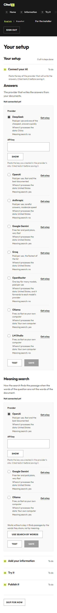
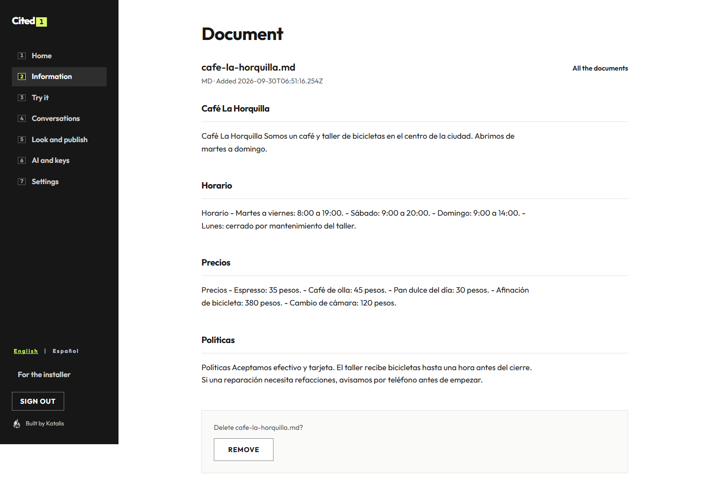
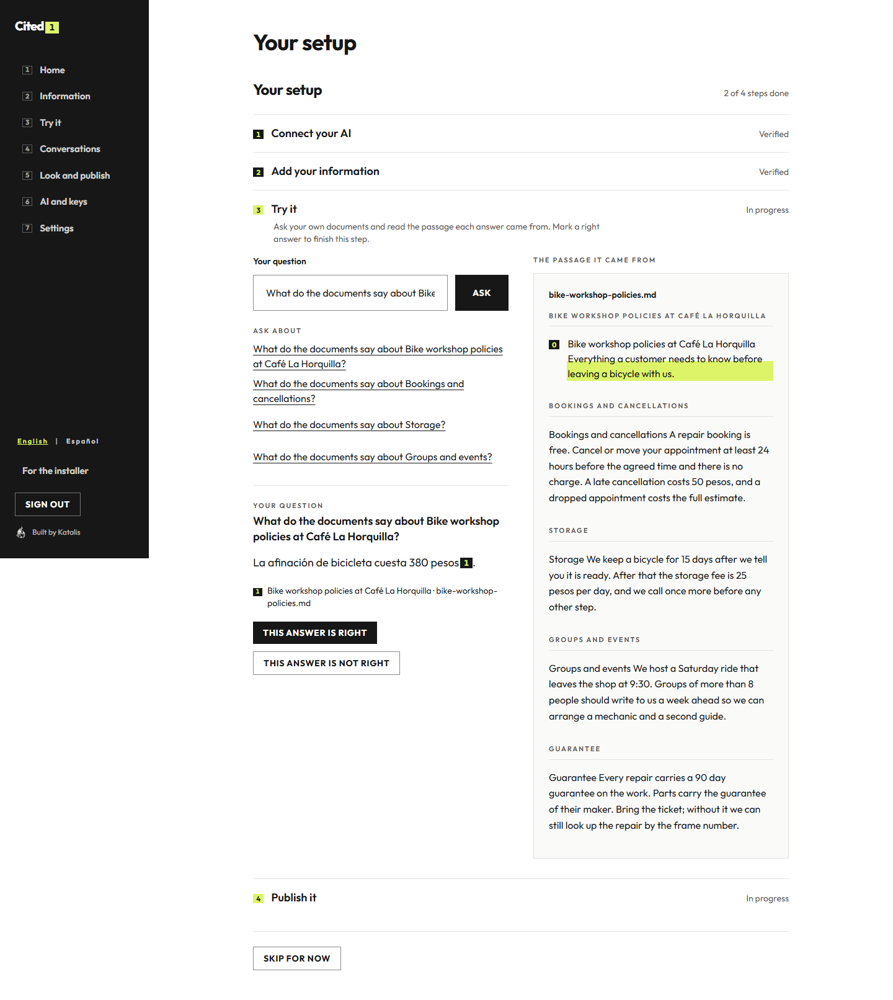
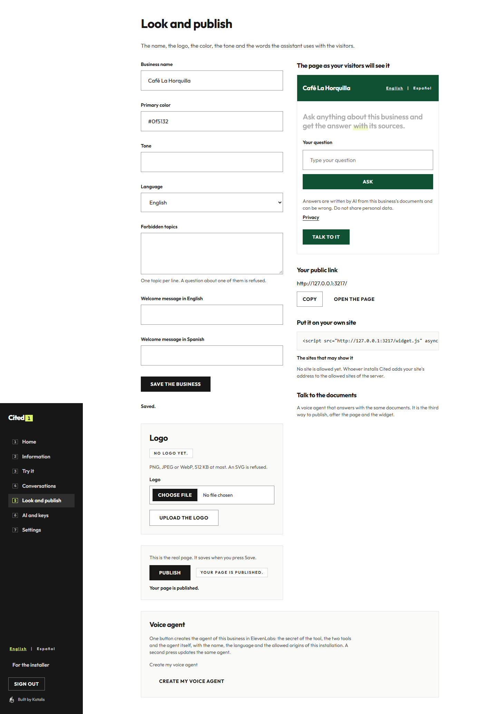
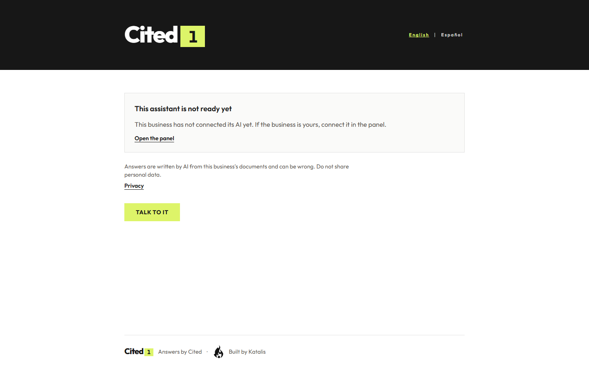
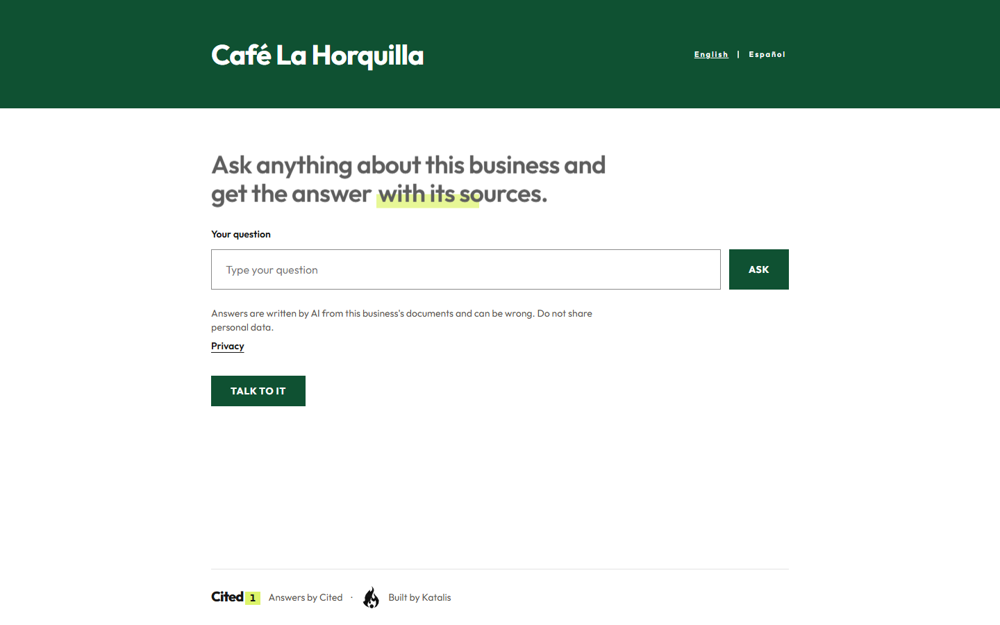

# The owner guide of Cited

From an empty panel to a published answer, in four steps and about five minutes, with no server and no terminal. This
guide is the walk the panel offers: every screen says what to do next, and every step proves itself before the next one.

[Español](#guía-del-dueño-de-cited) · [README](https://github.com/RonnieGex/cited#readme) · [The panel in detail](admin.md)

## The four steps

The first visit is one sentence of value, "4 steps, about 5 minutes" and one button. After **Start**, the four steps
are one page: each opens in its place with its state (to do, in progress, verified, needs attention) and each one
proves itself before the next.

### 1. Connect your AI

The list of providers, each one with an honest line (what it costs, where it processes the data, whether it offers
meaning search) and a link to get a key. Paste the key, press **Test** and the provider answers; only then can it be
saved, encrypted, and from then on only its last four characters are shown.

The step is finished when the AI answers and the way to search is chosen: if the provider of the answers does not offer
meaning search, the same step offers a second key for it or the search by words, which needs no key at all and is enough
to start.

### 2. Add your information

Drag several files at once (PDF, Word, Markdown or text) or press **Try it with a sample business**: the panel ingests
the corpus of `samples/` and fills the name of the business with Café La Horquilla, and both can be undone by removing
the documents it added. Every file says what is happening to it and how it ended: uploading, reading, splitting into
passages, ready with its number of passages, or the reason it failed and what to do (a scan, a file over the limit, a
type we do not read, no text, the search not connected).

Every document opens as a page of its own with its passages grouped under their headings in reading order, which is
what the system understood from the file. The removal opens a window of a few seconds in which nothing has been deleted
yet, with a button that keeps the document.

### 3. Try it

Ask your own documents. The answer appears with its numbered citations on the left and, on the right, the document of
the first citation opens with that passage in the highlighter; any other mark opens its own passage. Above the box, up
to four suggested questions come from the headings of your documents. When the documents do not say it, the panel says
so and suggests what to add.

**This answer is right** verifies the third step. If an answer is not right, the step asks for attention instead of
turning green, which is the honest way of saying that something in the documents needs a look.

### 4. Publish it

The business form (name, logo, color, tone, language, forbidden topics and the welcome in English and Spanish) sits
beside the live preview of the public page: save and the preview comes back with the new business, with no need to
reload the panel. Under it, the public link with its copy and open controls, the widget code with the sites that may
embed it, and the voice agent, which is the third way of publishing after the page and the widget.

**Publish** verifies the fourth step. The public page carries, always, that the answers are written by AI from the
business's documents and can be wrong, that personal data should not be shared, and the link to `/privacy`, which names
the providers the business uses and where each one processes the data.

## After the setup

The workspace keeps the seven sections of the panel — Home, Information, Try it, Conversations, Look and publish, AI
and keys, Settings — each numbered like a citation. Home says what is missing (each step is a door back into the guided
setup) and the latest questions. "For the installer" lives under Settings and it is the only page of the panel that
names a variable of the environment.

A public surface with no AI connected does not lie: it says the assistant is not ready yet and offers the owner the way
into the panel, and it never offers a box that cannot answer.

## Guía del dueño de Cited

De un panel vacío a una respuesta publicada, en cuatro pasos y unos cinco minutos, sin servidor y sin terminal. Esta
guía es el recorrido que ofrece el panel: cada pantalla dice qué hacer después y cada paso se prueba antes del
siguiente.

### 1. Conecta tu IA

El panel abre con una frase de valor, "4 pasos, unos 5 minutos" y un botón. Pulsa **Empezar** y el primer paso queda
abierto: la lista de proveedores, cada uno con una línea honesta (cuánto cuesta, dónde trata los datos, si ofrece
búsqueda por significado) y un enlace para conseguir una llave. Pega la llave, pulsa **Probar** y el proveedor
responde; solo entonces se puede guardar, cifrada, y desde ese momento solo se ven sus últimos cuatro caracteres.

El paso queda terminado cuando la IA responde y la forma de buscar está elegida: si el proveedor de las respuestas no
ofrece búsqueda por significado, el mismo paso ofrece una segunda llave para eso o la búsqueda por palabras, que no
necesita ninguna y alcanza para empezar.

### 2. Agrega tu información

Arrastra varios archivos a la vez (PDF, Word, Markdown o texto) o pulsa **Probar con un negocio de ejemplo**: el panel
ingiere el corpus de `samples/` y rellena el nombre del negocio con Café La Horquilla, y las dos cosas se deshacen
quitando los documentos que agregó. Cada archivo dice qué está pasando con él y cómo terminó: subiendo, leyendo,
dividiendo en pasajes, listo con su número de pasajes, o el motivo por el que falló y qué hacer (un escaneo, un archivo
sobre el límite, un tipo que no leemos, sin texto, la búsqueda sin conectar).

Cada documento se abre como una página propia con sus pasajes agrupados bajo sus apartados en orden de lectura, que es
lo que el sistema entendió del archivo. El botón de quitar abre una ventana de unos segundos en la que todavía no se
borró nada, con un botón que conserva el documento.

### 3. Pruébalo

Pregunta a tus propios documentos. La respuesta aparece con sus citas numeradas a la izquierda y, a la derecha, el
documento de la primera cita se abre con ese pasaje en el resaltador; cualquier otra marca abre su propio pasaje.
Arriba de la caja, hasta cuatro preguntas sugeridas salen de los títulos de tus documentos. Cuando los documentos no lo
dicen, el panel lo dice y sugiere qué agregar.

**Esta respuesta es correcta** verifica el tercer paso. Si una respuesta no lo es, el paso pide atención en vez de
ponerse verde, que es la manera honesta de decir que algo en los documentos necesita una mirada.

### 4. Publícalo

El formulario del negocio (nombre, logo, color, tono, idioma, temas prohibidos y la bienvenida en inglés y español)
está al lado de la vista previa viva de la página pública: guarda y la vista vuelve con el negocio nuevo, sin recargar
el panel. Debajo, el enlace público con sus controles de copiar y abrir, el código del widget con los sitios que pueden
incrustarlo, y el agente de voz, que es la tercera manera de publicar después de la página y el widget.

**Publicar** verifica el cuarto paso. La página pública lleva, siempre, que las respuestas las escribe una IA a partir
de los documentos del negocio y pueden estar equivocadas, que no se compartan datos personales, y el enlace a
`/privacy`, que nombra los proveedores que usa el negocio y dónde trata cada uno los datos.

### Después de la configuración

El espacio de trabajo conserva las siete secciones del panel — Inicio, Información, Pruébalo, Conversaciones,
Apariencia y publicación, IA y llaves, Ajustes — cada una numerada como una cita. Inicio dice qué falta (cada paso es
una puerta de vuelta a la configuración guiada) y las últimas preguntas. "Para quien instala" vive bajo Ajustes y es la
única página del panel que nombra una variable del entorno.

Una cara pública sin IA conectada no miente: dice que el asistente todavía no está listo y le ofrece al dueño la
entrada al panel, y nunca ofrece una caja que no puede responder.
